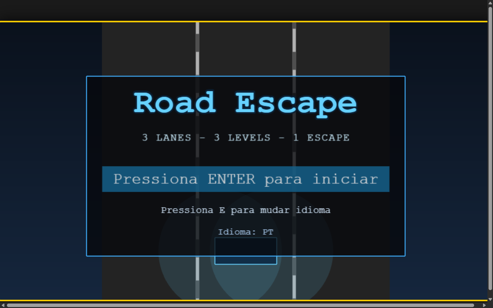
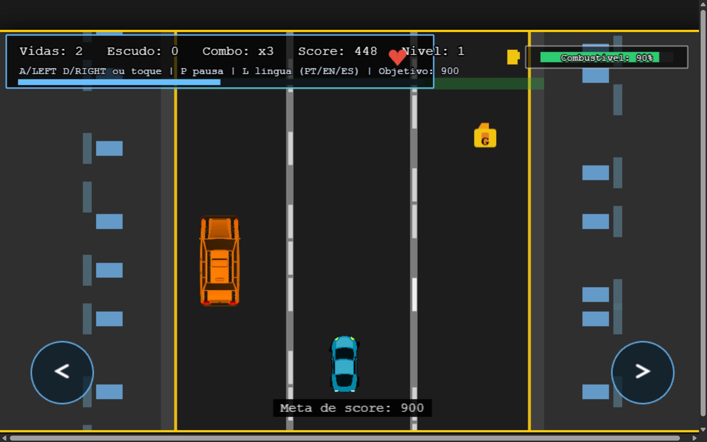
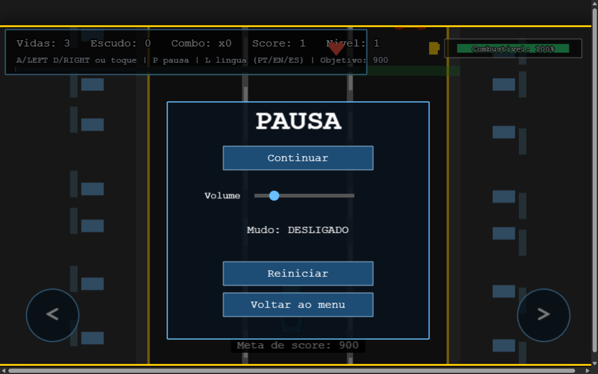
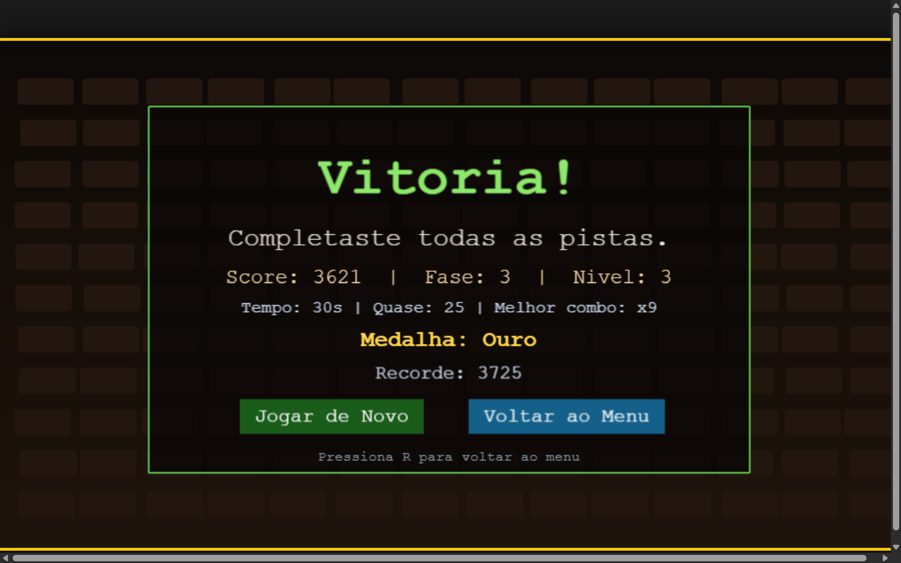
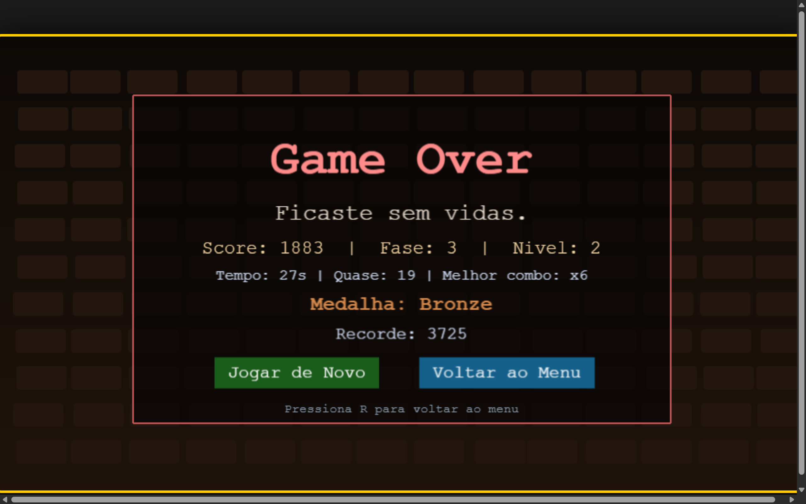
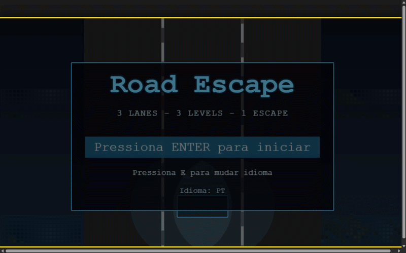

# [Nome do Jogo / Projeto de Phaser]

## 👥 Autores
* **Afonso Barbosa** - Nº 33157
* **Francisco Gomes** - Nº 33400

---

## 🛠️ Instruções de Execução

O jogo foi desenvolvido utilizando a framework **Phaser 3** (Arcade Physics). Para executar o projeto localmente, siga os passos abaixo:

### Pré-requisitos
É necessário um servidor local para contornar as restrições de CORS do browser ao carregar os assets (áudio e imagens). Recomendamos o uso do **VS Code** com a extensão **Live Server**, ou o Node.js.

### Passo a Passo
1. Faça o clone do repositório ou descompacte os ficheiros do projeto.
2. Abra a pasta raiz do projeto no seu editor de código (ex: VS Code).
3. Se usar o **Live Server**:
   * Clique com o botão direito no ficheiro `index.html` e escolha **"Open with Live Server"**.
4. Se usar **Node.js / npm** (via terminal):
   * Instale um servidor estático global (se não tiver): `npm install -g http-server`
   * Execute o servidor na raiz do projeto: `http-server`
   * Abra o browser no endereço indicado (normalmente `http://localhost:8080`).

---

## 🎨 Aspetos Multimédia

Esta secção detalha a gestão, origem e otimização de todos os recursos visuais e sonoros integrados no motor de jogo durante a fase de desenvolvimento.

### 🖼️ Elementos Gráficos e Otimização

| Asset | Formato | Dimensões Originais | Origem / Criação | Justificação Técnica de Resolução e Tamanho |
| :--- | :---: | :---: | :---: | :--- |
| `carro_anim.png` | PNG | 2790 x 1556 px | Edição / Criação Própria | Spritesheet de alta resolução contendo a animação do veículo do jogador. Dividida em frames de 465x518px para garantir a máxima nitidez em ecrãs modernos de alta densidade (Retina/4K). O redimensionamento para a estrada é feito via código (`setScale(0.15)`), permitindo manter a qualidade visual sem pixelização. |
| `taxi_anim.png` | PNG | 400 x 400 px | OpenGameArt / Editado | Obstáculo dinâmico do jogo. O asset original continha um fundo falso que comprometia a renderização da pista. Foi editado manualmente (recurso ao *remove.bg*) para garantir transparência real alfa. A resolução foi otimizada para equilibrar o peso do repositório e a escala final de colisão na faixa (`setScale(0.22)`). |
| `gazolina.svg` | SVG | Vetorial | Criação Própria | Item colecionável de combustível. Utiliza o formato vetorial (Scalable Vector Graphics), o que garante que o elemento mantém contornos perfeitamente nítidos em qualquer resolução de ecrã, com um peso de armazenamento praticamente nulo (poucos KB). |
| `meta.svg` | SVG | Vetorial | Criação Própria | Linha de meta / objetivo. À semelhança do combustível, o formato SVG foi escolhido para permitir que a linha estique e se ajuste perfeitamente à largura total da pista de forma responsiva sem perder definição. |

### 🔊 Elementos Sonoros (Áudio)

Todos os ficheiros de áudio foram convertidos e comprimidos no formato **MP3**. Esta escolha justifica-se pela necessidade de garantir compatibilidade universal entre browsers modernos e tempos de carregamento (*preload*) extremamente reduzidos, evitando que o jogo congele no `BootScene`.

* **`start.mp3`** (Origem: Freesound.org) - Efeito sonoro curto executado ao iniciar o motor do veículo.
* **`engine_loop.mp3`** (Origem: Freesound.org) - Áudio de rotação do motor em loop contínuo, otimizado para reprodução fluida sem quebras audíveis.
* **`bgmusic.mp3`** (Origem: OpenGameArt.org) - Banda sonora de fundo em loop para aumentar a imersão do jogador durante a corrida.
* **`collision.mp3`** (Origem: Freesound.org) - Efeito de impacto reproduzido instantaneamente quando a hitbox do jogador colide com um obstáculo.
* **`coin.mp3`** / **`phase_up.mp3`** (Origem: Freesound.org) - Feedback sonoro de recompensa ao interagir com itens ou subir de nível.
* **`level_clear.mp3`** / **`win.mp3`** / **`lose.mp3`** (Origem: Freesound.org) - Áudios de transição de estado de jogo para assinalar o sucesso ou fim da partida.

---

## 📸 Demonstração Gráfica (Multimedia & Gameplay)

### Capturas de Ecrã (Screenshots)

Abaixo encontram-se os registos visuais do jogo nas suas diferentes fases de execução. Os ficheiros físicos encontram-se guardados na diretoria `docs/screenshots/`.

#### Menu Principal

#### Corrida em Execução (Gameplay)
*Demonstração do alinhamento perfeito de Hitboxes através do modo de debug físico ativo.*

#### Menu de Pausa

#### Écrã Final (Game Over / Vitória)

### 📹 Demonstração em Movimento

---

## 🌐 Demonstração Online (GitHub Pages)
O projeto pode ser jogado diretamente no browser sem necessidade de instalações locais através do link:
👉 **[Inserir link do GitHub Pages aqui, ex: https://utilizador.github.io/repositorio]**